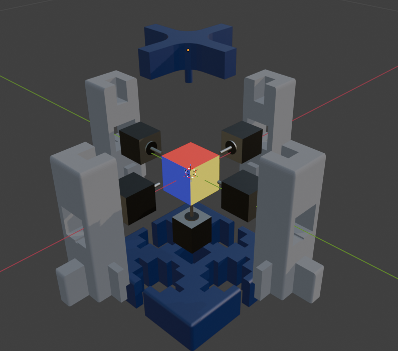

# Pi Cubed - L3-G6
**CU Winter 2026**

> Pi Cubed is a high-speed automated Rubiks cube solver implemented as a distrubuted system.
> This Repo Contains an overview of the Winter 2026 SYSC3010 Computer Systems Design Project for our team (L3-G6). 

---

## Table of Contents
1. [Who Are We?](#who-are-we)
2. [What Is Our Project?](#what-is-our-project)
3. [How Does It Work?](#how-does-it-work)
4. [How Do I Use It?](#how-do-i-use-it)
5. [Further Reading](#further-reading)
6. [License](#license)

---

## Who Are We?

 > We are a team of computer systems engineers collaborating for our term project. 

| Name | Role | Pi Node | Contact Information |
| :--- | :--- | :--- | :--- |
| **Luke Grundy** | Custom Solver Algo - Project Leader | Solver Node | [Email Address](mailto:lukegrundy@cmail.carleton.ca) |
| **Eric McFetridge** | Motor Logic and Hardware | Motor (Actuator) Node | [Email Address](mailto:ericmcfetridge@cmail.carleton.ca) |
| **Saim Hashmi** | Server Stack (DB, API, GUI) | Control Server Node | [Email Address](mailto:saimhashmi3@cmail.carleton.ca) |
| **Basil Thotapilly** | Optical Cube Recognition | Scanner (Sensor) Node | [Email Address](mailto:basilthotapilly@cmail.carleton.ca) |
---

## What Is Our Project?

* **Purpose:** solve the cube as fast as possible, and without human input by using a series of subsystems that pipeline the information.
* **Target Audience:** Anyone who is iterested in Rubiks cubes or cool tech will love Pi Cubed. Especially interesting for those looking to learn more on Desigining Algorithms, Distributed Architecture , Robotics, and Real-Time systems.
* **Key Features:** Distrubuted system with subsystem heartbeats - Provides a watchdog that can automatically handle errors from subsystems upon detection. Most solvers are not distrubuted in this way. 

---

## How Does It Work?

The system uses one control node paired with three edge nodes. Each edge node is responsible for a subsystem within the cube solver. These three systems in order of activation are: The Scanner, The Solver, and The Actuator. 
This allows us to have specific tasks per Pi, instead of a traditional solver which often only uses 1 main compute unit. This allows us to build our system with built in error handling and potential for redundancy, 
as the control server can detect when a subsystem is down and gracefully enter a holding state until it is back online. Our design follows modular principles where each Pi just focuses on doing just one task and doing it well.
The communication always starts at the server and ends at the server. This gives us a traceable log of every data transfer made and system heartbeat received. Allowing for easier debugging and also allows us to develop each part
completely independently by using a centralized DB and API for the final Pi to server communication. 

### System Architecture
The application is built on a modular architecture to ensure scalability and ease of maintenance. 

* **Frontend Layer:** short explanation of gui workings and dependencies.
* **Backend Services:** short explanation of backend and API and dependencies.
* **Data Persistence:** short explanation of db used and schema and dependencies.
* **Optical Recognition** short explanation of scanning tech dependencies
* **Motor Control** Motor Control is performed via 5x TMC2209 stepper motor drivers operating at a peak of 24v 1.4A offering snappy spins for cube moves.
* **Driver Control** A driver control board (BTT SKR v1.4 w/ Klipper firmware) use used to interface all 5 motor drivers with a single usb cable from the Pi. Removing the need for uart & manual clock signals.
* **Network Protocol** Short explanation of how Pi to server communication happens (we are using sockets) 

---

## How Do I Use It?

Controlling Pi Cubed is extrememly easy, as everything a user needs is offered through a user friendly GUI. 

  1. Place cube in frame of the Scanner Pis camera modules.
  2. Press "BEGIN SCAN" the gui will either tell you to proceed (state captured), or retry (bad scan) 
  3. On succesful scan we transition to the solving phase. Another confirmation box prompts you if you would like to start the solve.
  4. Press "BEGIN SOLVE" and wait. The cube solving logic will then begin on the solver node.
  5. Upon finding a succesful solve, the solver will confirm to the server it has completed, then the server sends the entire list of moves to the motor node.
  6. Finally, once the motor node has received the final solve string, it translates the strings from the server into raw motor commands to be sent to the driver board.
---

## Further Reading

| Project Component | Documentation Link | Content Description |
| :--- | :--- | :--- |
| **Control Server Details** | [View Docs](./docs/server) | GUI UX design and UI model | 
| **Motor System Details** | [View Docs](./docs/motor_control) | Further docs regarding the motor hardware . |
| **Scanning System Details** | [View Docs](./docs/scanner) | Further docs regarding scanner software and hardware. |
| **Cube Solving Algorithm Details** | [View Docs](./docs/solver) | Explanation of custom solving algorithm. |

---

## License

If adding license required in future we can link to ./license here
